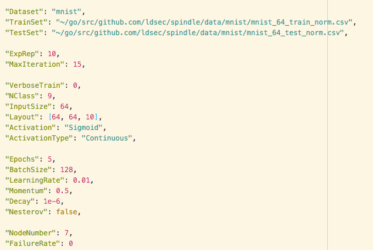

# Prototype for data decentralization and server failure modelling


<!-- TABLE OF CONTENTS -->
## Table of Contents

* [About the Project](#about-the-project)
  * [Dependencies](#dependencies)
* [Getting Started](#getting-started)
  * [Prerequisites](#prerequisites)
  * [Installation](#installation)
* [Usage](#usage)
* [Add new data set](#add-new-data-set)
* [Contributor](#contributor)
* [Acknowledgements](#acknowledgements)


<!-- ABOUT THE PROJECT -->
## About The Project

In this project we build a prototype of distributed neural network model with decentralized servers. The main goal of these prototypes is to study the effects on distributed neural network model capacity of:

1. Data decentralization
2. Server failure


### Dependencies

* [go-deep library](https://github.com/patrikeh/go-deep)


<!-- GETTING STARTED -->
## Getting Started

The project is in the [protocols/benchmarking](https://github.com/ldsec/spindle/tree/distributed_nn/protocols/benchmarking/neural_network) folder from the [Spindle project](https://github.com/ldsec/spindle/tree/distributed_nn)

### Prerequisites

To run the project you must install the go-deep library:

* The official version can be downloaded with the following command:
```Go
go get github.com/patrikeh/go-deep
```

* A modified version of this library with approximated activation function:
```Go
go get github.com/raphaelreis/go-deep-mod
```

### Installation
 
Install the Spindle repo
```Go
go get github.com/ldsec/spindle
```


<!-- USAGE EXAMPLES -->
## Usage

### Protocol configuration

The protocols configuration's parameters can be modified in the config.json file from the [config](https://github.com/ldsec/spindle/tree/distributed_nn/protocols/benchmarking/neural_network/config) folder. Parameters that are not used in the centralized protocol are not parsed (e.g: "NodeNumber", "FailureRate") and don't need to be removed from the configuration file.

A typical exemple of configuration for the mnist dataset is:



where parameters are:

* "Dataset": the name of the dataset. So far there is mnist, breast cancer and diabete are recognized. Values
  * MNIST: "mnist"
  * Breast cancer: "bc"
  * Diabete: "diabete"
* "TrainSet", "TestSet": the path to the train test sets files.
* "ExpRep": the number of experiment repetition
* "MaxIteration": the number of iteration bottom-up/top-down passes. 
* "VerboseTrain": verbosity of the training phase. In decentralized protocol, with many nodes, verbose training can become undreadable. Values:
  * 0: no information about node training
  * 1: train time | loss value | accuracy 
* "NClass": the number of classes for a classification task. 
* "InputSize": the number of data set's features
* "Layout": the architecture of the deep network. It must typically be a list of integers  (e.g.[64, 64, 10]). The last integer is the last layer's number of neurons.
* "Activation": the activation function for each hidden layer. So far, sigmoid and relu are implemented.
* "ActivateType": if you download the official go-deep library, no need to change these parameters. However, if you download the go-deep-mod library, this parameter allow you to chose between continous activation function or approximated one.
  * "Continuous": continuous activation function
  * "Approx": Taylor Series approximiated activation function

* "Epochs", "BatchSize", "LearningRate", "Momentum", "Decay", "Nesterov": the optimization parameters/hyperparameters.

> **For decentralized protocol only**:
> * "NodeNumber": the number of nodes in the decentralized system
> * "FailureRate": the probability for each server to fail at the begining of the protocol. A server fails at the beginning of the protocol and never come back to a working mode.

### Run an experiment

The experiments are run with Go tests. Since the default go test timeout is 10 minutes, you must add a -timout flag to extend this duration (e.g.: -timeout 3h)

**Centralized**

To run the centralized protocol, cd to the centralized repo and run:
```Go
go test -run TestCentralizedLearning -v -timeout 3h
```

**Decentralized**

To run the decentralized protocol, cd to the decentralized repo and run: 
```Go
go test -run TestDecentralizedLearning -v -timeout 3h
```

## Add new protocol parameters

To parametrize the protocols, both centralized and decentrlized use the `conf.go` file.

To add a new parameter to the protocol, first add the parameter in the `conf`struct in the `conf.go` file. Then add the value to the config/config.json file with a specified value.

It is not mandatory to add a parameter to both protocols (e.g. see NodeNumbers, FailureRate parameters).

Then in the protocol, you can access the specified value with `conf.WhatEverValueYouLike` for centralized protocol and `p.ProtocolConf.WhatEverValueYouLike` for decentralized protocol.


## Add new data set

To build neural network input from raw csv, we rely on the `dataloader.go` file.

To add a new dataset, you need to implement a new ToExample function. This function is a csv parser. See for example the function to parse the mnist dataset:

```Go
func mnistToExample(in []string) training.Example {
	res, err := strconv.ParseFloat(in[len(in)-1], 64)
	if err != nil {
		panic(err)
	}
	resEncoded := onehot(10, res)
	var features []float64
	for i := 0; i < len(in)-1; i++ {
		res, err := strconv.ParseFloat(in[i], 64)
		if err != nil {
			panic(err)
		}
		features = append(features, res)
	}

	return training.Example{
		Response: resEncoded,
		Input:    features,
	}
}
```

You must also modify the `if` statement in the Load function to parse the data set parsing function correctly. See:

```Go
if dataset == "mnist" {
		toExample = mnistToExample
	} else if dataset == "bc" {
		toExample = bcToExample
	} else if dataset == "diabete" {
		toExample = diabeteToExample
  } else {
    ...
    toExample = yourNewDataSetToExample
  }

```

<!-- CONTACT -->
## Contributor

Raphaël Reis Nunes

<!-- ACKNOWLEDGEMENTS -->
## Acknowledgements

* [go-deep library](https://github.com/patrikeh/go-deep)
* [cothority framework](https://github.com/dedis/cothority)
